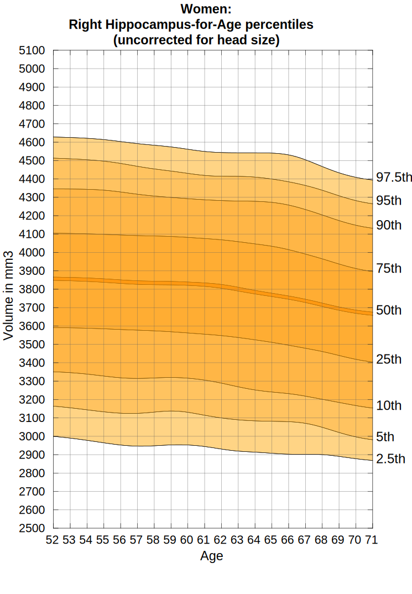

# Quantifying Alzheimer's Disease Progression Through Automated Measurement of Hippocampal Volume

## Background

Alzheimer's disease (AD) is a progressive neurodegenerative disorder that results in impaired neuronal (brain cell) function and eventually, cell death. AD is the most common cause of dementia. Clinically, it is characterized by memory loss, inability to learn new material, loss of language function, and other manifestations. 

For patients exhibiting early symptoms, quantifying disease progression over time can help direct therapy and disease management. 

A radiological study via MRI exam is currently one of the most advanced methods to quantify the disease. In particular, the measurement of hippocampal volume has proven useful to diagnose and track progression in several brain disorders, most notably in AD. Studies have shown reduced volume of the hippocampus in patients with AD.

The hippocampus is a critical structure of the human brain (and the brain of other vertebrates) that plays important roles in the consolidation of information from short-term memory to long-term memory. In other words, the hippocampus is thought to be responsible for memory and learning (that's why we are all here, after all!)

Humans have two hippocampi, one in each hemishpere of the brain. They are located in the medial temporal lobe of the brain. Fun fact - the word "hippocampus" is roughly translated from Greek as "horselike" because of the similarity to a seahorse, a peculiarity observed by one of the first anatomists to illustrate the structure.

According to [studies](https://www.sciencedirect.com/science/article/pii/S2213158219302542), the volume of the hippocampus varies in a population, depending on various parameters, within certain boundaries, and it is possible to identify a "normal" range when taking into account age, sex and brain hemisphere. 

There is one problem with measuring the volume of the hippocampus using MRI scans, though - namely, the process tends to be quite tedious since every slice of the 3D volume needs to be analyzed, and the shape of the structure needs to be traced. The fact that the hippocampus has a non-uniform shape only makes it more challenging. Do you think you could spot the hippocampi in this axial slice?

As you might have guessed by now, we are going to build a piece of AI software that could help clinicians perform this task faster and more consistently.

You have seen throughout the course that a large part of AI development effort is taken up by curating the dataset and proving clinical efficacy. In this project, we will focus on the technical aspects of building a segmentation model and integrating it into the clinician's workflow, leaving the dataset curation and model validation questions largely outside the scope of this project.

## What You Will Build

In this project you will build an end-to-end AI system which features a machine learning algorithm that integrates into a clinical-grade viewer and automatically measures hippocampal volumes of new patients, as their studies are committed to the clinical imaging archive.

Fortunately you won't have to deal with full heads of patients. Our (fictional) radiology department runs a HippoCrop tool which cuts out a rectangular portion of a brain scan from every image series, making your job a bit easier, and our committed radiologists have collected and annotated a dataset of relevant volumes, and even converted them to NIFTI format!

You will use the dataset that contains the segmentations of the right hippocampus and you will use the U-Net architecture to build the segmentation model.

After that, you will proceed to integrate the model into a working clinical PACS such that it runs on every incoming study and produces a report with volume measurements.

## The Dataset

We are using the "Hippocampus" dataset from the [Medical Decathlon competition](http://medicaldecathlon.com/). This dataset is stored as a collection of NIFTI files, with one file per volume, and one file per corresponding segmentation mask. The original images here are T2 MRI scans of the full brain. As noted, in this dataset we are using cropped volumes where only the region around the hippocampus has been cut out. This makes the size of our dataset quite a bit smaller, our machine learning problem a bit simpler and allows us to have reasonable training times. You should not think of it as "toy" problem, though. Algorithms that crop rectangular regions of interest are quite common in medical imaging. Segmentation is still hard.

## The Programming Environment

You will have two options for the environment to use throughout this project:

### Udacity Workspaces

These are setup environments that contains all you need from the Local Environment section below that you can run directly on your web browser.

### Local Environment

If you would like to run the project locally, you would need a Python 3.7+ environment with the following libraries for the first two sections of the project:

* [PyTorch (recommended with CUDA)](https://pytorch.org/)
* [nibabel](https://nipy.org/nibabel/)
* [matplotlib](https://matplotlib.org/users/installing.html)
* [numpy](https://numpy.org/)
* [pydicom](https://pydicom.github.io/pydicom/stable/tutorials/installation.html)
* [Pillow (should be installed with pytorch)](https://pillow.readthedocs.io/en/stable/installation.html)
* [tensorboard](https://pypi.org/project/tensorboard/)

In the 3rd section of the project we will be working with three software products for emulating the clinical network. You would need to install and configure:

* [Orthanc server](https://www.orthanc-server.com/download.php) for PACS emulation
* [OHIF zero-footprint web viewer](https://docs.ohif.org/development/getting-started.html) for viewing images. Note that if you deploy OHIF from its github repository, at the moment of writing the repo includes a yarn script (`orthanc:up`) where it downloads and runs the Orthanc server from a Docker container. If that works for you, you won't need to install Orthanc separately.
* If you are using Orthanc (or other DICOMWeb server), you will need to configure OHIF to read data from your server. OHIF has instructions for this: https://docs.ohif.org/configuring/data-source.html
* In order to fully emulate the Udacity workspace, you will also need to configure Orthanc for auto-routing of studies to automatically direct them to your AI algorithm. For this you will need to take the script that you can find at `section3/src/deploy_scripts/route_dicoms.lua` and install it to Orthanc as explained on this page: https://book.orthanc-server.com/users/lua.html
* [DCMTK tools](https://dcmtk.org/) for testing and emulating a modality. Note that if you are running a Linux distribution, you might be able to install dcmtk directly from the package manager (e.g. `apt-get install dcmtk` in Ubuntu)

## Project Instructions

### Section 1: Curating a dataset of Brain MRIs

You will perform this section in the **Workspace 1**. This workspace has a Python virtual environment called **medai** which is set up with everything that you need to train your ML model. This workspace also has a GPU which will speed up your training process quite significantly.

The data is located in `/data/TrainingSet` directory [here](https://github.com/udacity/nd320-c3-3d-imaging-starter/tree/master/data/TrainingSet).

In the project directory called `section1` you will find a Python Notebook that has a few instructions in it that will help you inspect the dataset, understand the clinical side of the problem a bit better, and get it ready for consumption by your algorithm in **Section 2**. The notebook has 2 types of comments:
- Comments marked with `# TASK: `are tasks, instructions, or questions you **have** to complete.
- Comments not marked are not mandatory but are suggestions, questions, or background that will help you get a better understanding of the subject and apply your newly acquired medical imaging dataset EDA skills.

### Instructions

Once you complete the tasks, copy the following to the directory `section1/out`:  
1. Curated dataset with labels, as collection of NIFTI files. Amount of training image volumes should be the same as the amount of label volumes.
2. A Python Notebook with the results of your Exploratory Data Analysis. If you prefer to do it in raw Python file, that is also acceptable - in that case put the .py file there, making sure that you copy Task descriptions from the notebook into your comments.

### Udacity Workspace Notes

You can access the Desktop when you hit the button at the bottom right-hand corner.

**Jupyter Notebooks**  

In any terminal use the following command and find the URL contained in the box created by the asterisks(*):
`bash launch_jupyter.sh`

**View Slicer**  

When you enter the Desktop you should find a Slicer icon on the left-hand column. If you double click on that it should start-up Slicer.
Download the curated dataset

1. Navigate to the folder with the curated dataset in /out in the folder panel.
2. Right click the folder in the folder panel on the right side of the workspace.
3. Select Download.

#### Expected Outcome

Navigate to the directory `section1/out` to find the [README.md](section1/out/README.md) with instructions on what is expected as the outcome. 

### Section 2: Training a segmentation CNN

You will perform this section in the same workspace as Section 1: **Workspace 1**. This workspace will have the same environment as Workspace for Section 1 and will have everything that you need to train the machine learning model for segmentation.

In the directory called `section2/src` you will find the source code that forms the framework for your machine learning pipeline.

You will be using [PyTorch](https://pytorch.org/) to train the model, similar to our Segmentation&Classification Lesson, and we will be using [Tensorboard](https://www.tensorflow.org/tensorboard/) to visualize the results.

You will use the script `run_ml_pipeline.py` to kick off your training pipeline. You can do so right now! The script will not get far, though. It only contains the skeleton of the final solution and a lot of comments. You will need to follow the instructions inside the code files to complete the section and train your model. Same convention is used as in Section 1:

* Comments that start with `# TASK` are tasks, instructions, or questions you **have** to complete
* All other types of comments provide additional background, questions or contain suggestions to make your project stand out.

You will need to complete all the instructional comments in the code in order to complete this section. You can do this in any order, but it makes most sense to start with the code in `run_ml_pipeline.py`.

The code has hooks to log progress to Tensorboard. In order to see the Tensorboard output you need to launch Tensorboard executable from the same directory where `run_ml_pipeline.py` is located using the following command:

> `tensorboard --logdir runs --bind_all`

After that, Tensorboard will write logs into directory called `runs` and you will be able to view progress by opening the browser and navigating to default port 6006 of the machine where you are running it.

### Instructions

Once you complete this section, copy the following to the directory `section2/out`:

1. Functional code that trains the segmentation model
2. Test report with Dice scores on test set (can be json file). Your final average Dice with the default model should be around .90
3. Screenshots from your Tensorboard (or other visualization engine) output, showing Train and Validation loss plots, along with images of the predictions that your model is making at different stages of training
4. Your trained model PyTorch parameter file (model.pth)

#### Stand-out Suggestions

Optionally, you can look into the following to make your project stand out. Put the deliverables in the output directory.

- Can you write a 1-page email explaining what your algorithm is doing to a clinician who will be trying it out, but whom you never met? Make sure you include performance characteristics with some images. Try using their language and think of what would be the important information that they are looking for?
- Implement additional metrics in the test report such as Jaccard score, sensitivity or specificity. Think of what additional metrics would be relevant.
- In our dataset we have labels of 2 classes - anterior and posterior segments of the hippocampus. Can you train a version of model that segments the structure as a whole, only using one class? Is the performance better, the same or worse?
- Write up a short report explaining requirements for your training process (compute, memory) and suggestions for making it more efficient (model architecture, data pipeline, loss functions, data augmentation). What kind of data augmentations would NOT add value?
- What are best and worst performing volumes? Why do you think that's the case?

#### Udacity Workspace Notes

Always run the workspace with GPU on to be in the correct environment. This will also let you access the **Desktop** when you hit the button at the bottom right-hand corner.
**NOTE** The workspace can time out while you are running your training job if you do not work with the workspace for 2 - 5 minutes. If you find that your training process taking longer than that, either reduce the number of epochs or run any command in the terminal, like ls to keep the workspace active.
Upload the dataset

1. Click on the **+** at the upper right hand corner of the folder panel in the workspace.
2. Select **Upload File** to upload the zipped dataset.
3. Run the command `tar xf <filename>` to unzip the dataset.

**Download the Trained Model/Code**  

1. Navigate to the location of the model parameter file `model.pth` you want to download in the folder panel.
2. Right click the file in the folder panel on the left side of the workspace.
3. Select Download.

**View Slicer**  

When you enter the Desktop you should find a Slicer icon on the left-hand column. If you double click on that it should start-up Slicer.

**Tensorboard**  
1. Make sure you enable GPU.
2. In a terminal move to the src directory through `cd src`
3. Then run the following command to start `tensorboardtensorboard --logdir runs --bind_all`
4. The output should have a URL
5. Copy that URL
6. Open the Desktop with the **Desktop** button at the bottom right hand corner and copy the URL. (It will look something like `http://f8196ac7f2cc:6006/`)
7. If not already open, open a browser.
8. On the left hand side there will be an arrow, if you click the arrow, a sidebar that will popup.
9. Click on the 2nd icon on the sidebar which is a clipboard and paste the URL here.
10. In the address bar you can right click and select **Paste & Go**.

#### Expected Outcome

Navigate to the directory `section2/out` to find the [README.md](section2/out/README.md) with instructions on what is expected as the outcome.

### Section 3: Integrating into a clinical network

In this final section you will use some of the work you did for Section 2 to create an AI product that can be integrated into a clinical network and provide the auto-computed information on the hippocampal volume to the clinicians. While hospital integrations are typically handled by hospital IT staff, it will help tremendously if you can talk the same language with the people who will operate your model, and will have a feel for how clinical radiological software works. These skills will also help you debug your model in the field.

You will perform this section in a different workspace than the previous two sections: **Workspace 3**. This workspace is a simpler hardware, with no GPU, which is more representative of a clinical environment. This workspace also has a few tools installed in it, which is replicates the following clinical network setup:

Specifically, we have the following software in this setup:

* MRI scanner is represented by a script `section3/src/deploy_scripts/send_volume.sh`. When you run this script it will simulate what happens after a radiological exam is complete, and send a volume to the clinical PACS. Note that scanners typically send entire studies to archives.
* PACS server is represented by [Orthanc](http://orthanc-server.com/) deployment that is listening to DICOM DIMSE requests on port 4242. Orthanc also has a DicomWeb interface that is exposed at port 8042, prefix /dicom-web. There is no authentication and you are welcome to explore either one of the mechanisms of access using a tool like curl or Postman. Our PACS server is also running an auto-routing module that sends a copy of everything it receives to an AI server. See instructions ad the end of this page on how to launch if you are using the Udacity Workspace.  
* Viewer system is represented by [OHIF](http://ohif.org/). It is connecting to the Orthanc server using DicomWeb and is serving a web application on port 3000. Again, see instructions at the end of this page if you are using the Udacity Workspace.
* AI server is represented by a couple of scripts. `section3/src/deploy_scripts/start_listener.sh` brings up a DCMTK's `storescp` and configures it to just copy everything it receives into a directory that you will need to specify by editing this script, organizing studies as one folder per study. HippoVolume.AI is the AI module that you will create in this section.

If you want to replicate this environment on your local machine, you will find instructions in the Project Overview concept.

As with Section 2, in the directory called `section3/src` you will find the source code that forms the skeleton of the HippoVolume.AI module.

`inference_dcm.py` is the file that you will be working on. It contains code that will analyze the directory of the AI server that contains the routed studies, find the right series to run your algorithm on, will generate report, and push it back to our PACS.

Note that in real system you would architect things a bit differently. Probably, AI server would be a separate piece of software that would monitor the output of the listener, and would manage multiple AI modules, deciding which one to run, automatically. In our case, for the sake of simplicity, all code sits in one Python script that you would have to run manually after you simulate an exam via the `send_volume.sh` script - `inference_dcm.py`. It combines the functions of processing of the listener output and executing the model, and it does not do any proper error handling :)

As before, you will need to follow the instructions inside the code files to complete the section and create your AI module. Same convention is used as in Sections 1 and 2: comments that start with `# TASK` instruct you to create certain code snippets, and all other types of comments provide background or stand-out suggestions.

You will need to complete all the instructional comments in the code in order to complete this section. You can do this in any order, but it makes most sense to start with the code in `inference_dcm.py`.

Once you complete the code, you can test it by running
> `deploy_scripts/send_volume.sh`

which will simulate a completion of MRI study and sending of patient data to our PACS, and then following that by running `inference_dcm.py`

The `send_volume.sh` script needs to be run from directory `section3/src` (because it relies on relative paths). If you did everything correctly, an MRI scan will be sent to the PACS and to your module which will compute the volume, prepare the report and push it back to the PACS so that it could be inspected in our clinical viewer.

At this point, go to *[YOUR IP ADDRESS]*:3000 (can be another port if you are using Udacity Workspace) which brings up our OHIF viewer. You should be able to inspect your report in all its glory, in the context of a radiological study presented to a radiologist in a clinical viewer!

The study that `send_result.sh` sends, and a few other sample studies are located in `/data/TestVolumes`. Feel free to modify the script to try out your algorithm with other volumes.

> Note, that the DICOM studies used for inferencing this section have been created artificially, and while full-brain series belong to the same original study, this is not the study from which the hippocampus crop is taken.

Now that you have built a radiological AI system and given it to clinicians, you can start collecting data on how your model performs in the real world. If you (or the company you work for) intends to commercialize your technology, you will have to clear the regulatory bar. As we have discussed in our final lesson, an important contribution of an AI engineer to this endeavor is helping execute the clinical validation by contributing to a validation plan. Your final task in this course is to write a draft of such plan (shoot for 1-2 pages for this exercise). Remember - clinical validation is all about proving that your technology performs the way you claim it does. If you are saying that it can measure hippocampal volume, your validation needs prove that it actually does, and establish the extents to which your claim is true. Your validation plan needs to define how you would prove this, and establish these extents.

For the purpose of this exercise, assume that you have access to any clinical facility and patient cohorts you need, and that you have all the budget in the world. Assume that you know where your data came from and that you know how to label it (just come up with a good story). In your plan, touch on at least the following:

* Your algorithm relies upon certain "ground truth" - how did you define your ground truth? How will you prove that your method of collecting the ground truth is robust and represents the population that you claim this algorithm is good for?
* How do you define accuracy of your algorithm and how do you measure it with respect to real world population? Check out the [calculator and report from HippoFit](http://www.smanohar.com/biobank/calculator.html) for some inspiration.
* How do you define what data your algorithm can operate on?

There is no right answer here - think of these and other questions that would come up during validation of such algorithm. Thinking of such things early on will help you build better algorithms in the first place.

### Instructions

Once you complete this section, copy the following into directory `section3/out`:

1. Code that runs inference on a DICOM volume and produces a DICOM report
2. A report.dcm file with a sample report
3. Screenshots of your report shown in the OHIF viewer
4. 1-2 page Validation Plan

#### Stand-out Suggestions

Optionally, look into the following to explore the subject deeper and make your project stand out. Put the deliverables in the output directory.

- Can you propose a better way of filtering a study for correct series?
- Can you think of what would make the report you generate from your inference better? What would be the relevant information that you could present which would help a clinician better reason about whether your model performed well or not?
- Try to construct a fully valid DICOM as your model output (per [DICOM PS3.3#A8](http://dicom.nema.org/medical/dicom/current/output/html/part03.html#sect_A.8)) with all relevant fields. Construction of valid DICOM has a very calming effect on the mind and body.
- Try constructing a DICOM image with your segmentation mask as a separate image series so that you can overlay it on the original image using the clinical image viewer and inspect the predicted volume better. Note that OHIF does not support overlaying - try using Slicer 3D or Radiant (Fusion feature). Include screenshots.

#### Udacity Workspace Notes

You can access the **Desktop** when you hit the button at the bottom right-hand corner.

**Upload the Trained Model**  

1. Click on the + at the upper right hand corner of the folder panel.
2. One of the options is to upload a file which you can use to upload your model (.pth file) from the previous section and any other content you would like to bring over.

**Running Shell Scripts inside the Workspace**  

In this exercise, you will need to run shell scripts from the `deploy_scripts` folder. These scripts won't work inside Udacity Workspace if you try to run the .sh files directly. In order to run these scripts from the Udacity Workspace you will need to copy the lines from within the .sh files, paste them into your terminal and run from there.

**Access Orthanc and OHIF**  

Before starting to work on the tasks in this workspace you should launch Orthanc and OHIF and here are the steps:

1    Open a terminal and enter the following:
    `bash launch_orthanc.sh` or `./launch_orthanc.sh`. Don't close this terminal
2.    Wait for it to complete, with the last line being something like
   ` W0509 05:38:21.152402 main.cpp:719] Orthanc has started` and/or you can verify that Orthanc is working by running `echoscu 127.0.0.1 4242 -v` in a new terminal.
3.    Open a new terminal and enter the following
    `bash launch_OHIF.sh` or `./launch_OHIF.sh`. Don't close this terminal
4.    Wait for it to complete, with the last line being something like
    `@ohif/viewer: ℹ ｢wdm｣: Compiled with warnings.`
5.    You will then want to enter the Desktop with the bottom right hand corner.
		- OHIF should automatically open in a Chromium Web Browser but if not you can paste `localhost:3005` into the address bar of a Chromium Window.
        - orthanc isn't necessary to open but if you need it you can access it can paste `localhost:8042` into the address bar of a Chromium Window.

#### Expected Outcome

Navigate to the directory `section3/out` to find the [README.md](section3/out/README.md) with instructions on what is expected as the outcome.

## Closing Remarks

If you were able to get here after completing all the tasks above - congratulations! You have gone through the challenging process of integrating knowledge of clinical context, data analysis, machine learning systems, and medical imaging networking to create a fully functional AI module for a radiological system.

Armed with this knowledge you will be able to get quickly started with a vast majority of problems in 3D radiological imaging space, and even transfer this knowledge over to non-radiological modalities that generate 3D images.

At the moment of writing in 2020, medical imaging AI is a very rapidly growing space, and the potential of the field is staggering. We are only starting to get access to good clinical datasets, the ImageNets of medical imaging is yet to come, clinician researchers are just starting to wrap their heads around what is possible with machine-learning-based technology and tools are becoming better every day. Information flow between data scientists and clinicians is key to unlocking the potential of medical AI and helping clinicians reduce the amount of mundane work, become more precise, efficient, and less stressed. This is just the beginning.

### Further Resources

If you are curious to learn more about the space and see what others are doing, here are a few useful resources, companies and societies to watch for.

#### Conferences and professional societies

* [MICCAI Society](http://www.miccai.org/) hosts an annual conference dedicated to medical imaging and related fields, and also hosts a number of challenges. One that has consistently generated good volumetric datasets is called [BRATS](http://braintumorsegmentation.org/)
* [Radiological Society of North America](https://www.rsna.org/) is a renowned organization that unifies medical imaging professionals around the globe. In addition to hosting the eponymous largest medical imaging conference in the world it has been turning more attention to AI recently, and hosted interesting medical imaging competitions within its "[AI challenge](https://www.rsna.org/en/education/ai-resources-and-training/ai-image-challenge)" program. Last year's challenged featured a classification problem for CT imaging (although with the focus on 2D methods)
* [SIIM](https://siim.org/page/meetings) is a society that focuses on medical imaging informatics and it has recently started running a machine learning sub-conference called C-MIMI

#### Academia

It wouldn't be much of an overstatement to say that almost every academic medical center in the world is running some sort of a medical imaging AI program. These are all very interesting since they are rooted in clinical expertise and benefit from access to data. They vary in size and often are a part of larger, disease-specific programs. A couple efforts worthy of noting are:

* [Center for Clinical Data Science](https://www.ccds.io/) by Parthers Healthcare
* [Stanford's AIMI](https://aimi.stanford.edu/)
* [National Consortium of Intelligent Medical Imaging](https://www.medsci.ox.ac.uk/research/networks/national-consortium-of-intelligent-medical-imaging), kicked off by the University of Oxford and the UK's National Health Service

#### Startups

There are plenty and there will be more. Some choose to pursue a clinical workflow, some focus on application of particular machine learning technique and some capitalize on existing clinical footprint and invest in platforms that accelerate others' efforts. Some established players are:

* [Cortechslabs](https://www.cortechslabs.com/) - focuses on quantitative analysis of brain images. Of particular note is the software called [Neuroquant](https://www.cortechslabs.com/products/neuroquant/) which uses deep learning to produce reports with MRI-based volumetric measurements of structures inside brain that are related to age-related neurodegenerative disorders such as Alzheimer's. Sounds familiar? :)
* [Mirada Medical](https://mirada-medical.com/) - Oxford-based company that advanced a field of radiation oncology with its deep-learning-based segmentation models
* [Arterys](https://www.arterys.com/) - Silicon Valley startup that was the first to obtain an FDA clearance for a deep learning medical imaging suite for oncology.
* [Enlitic](https://www.enlitic.com/) - San Francisco-based company aiming at diagnostic use cases that accelerate radiologic workflow
* [Nuance](https://www.nuance.com/healthcare/diagnostics-solutions/ai-marketplace.html) is a Boston-based company that produces a well established platform of choice for radiological dictation. Recently the company focused a lot of effort on a marketplace for medical imaging AI solutions where startups that do not quite have Nuance's reach can deploy their software.
* [Terarecon](https://www.terarecon.com/envoyai/exchange) - similarly to Nuance, this Californian company started in core diagnostic radiology and expanded with an AI marketplace offering branded "EnvoyAI"

#### Big Tech

Some big cloud providers are eyeing the space closely, and running their own programs and projects related to medical imaging.

* Microsoft Research has a [project dubbed InnerEye](https://www.microsoft.com/en-us/research/project/medical-image-analysis/) that for the past 10+ years has been exploring the use of machine learning for a variety of medical imaging applications. One of the instructors of this course had the honor of spending a significant part of his career as a team member here.
* Google DeepMind is a group within Google doing some cutting-edge AI research, including [some work on medical imaging](https://deepmind.com/blog/article/ai-uclh-radiotherapy-planning). We can credit them with the contribution to the invention of the U-net which has been prominently featured in this course.

## License

This project is licensed under the MIT License - see the [LICENSE.md](./LICENSE.md)

## Citations

[1] [www.sciencedirect.com/science/article/pii/S2213158219302542](https://www.sciencedirect.com/science/article/pii/S2213158219302542)  
[2] [en.wikipedia.org/wiki/Hippocampus](https://en.wikipedia.org/wiki/Hippocampus)  
[3] [medicaldecathlon.com/](http://medicaldecathlon.com/)